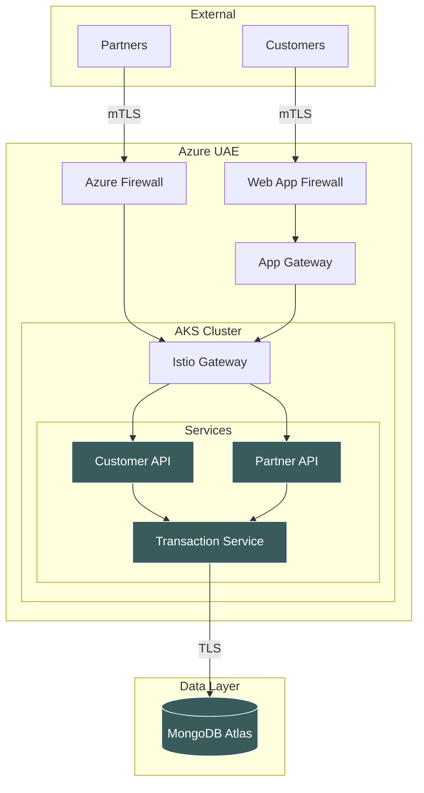
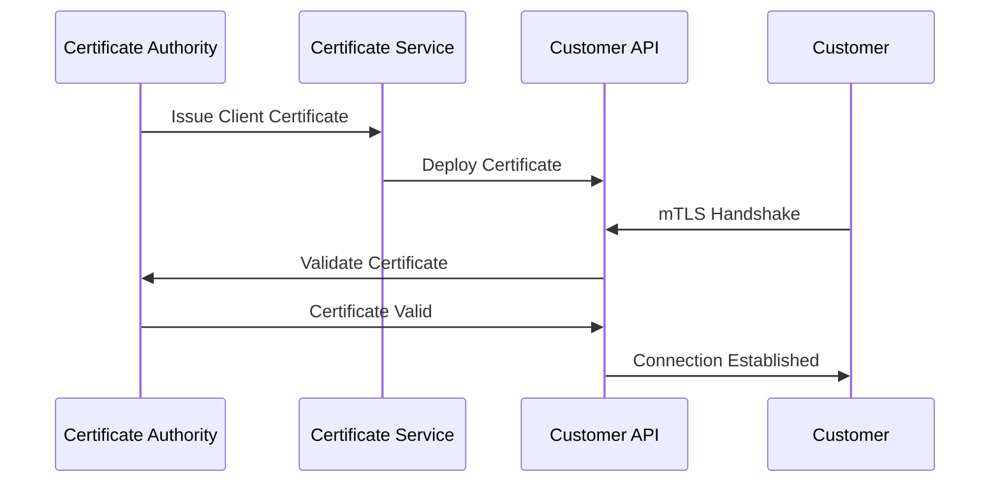
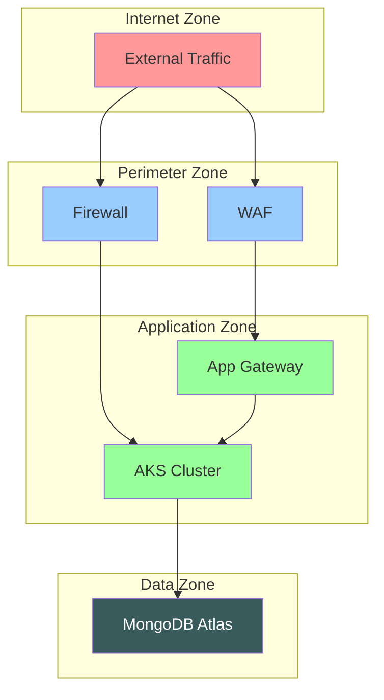

# Infrastructure Diagrams

## Diagram Categories

### 1. High-Level Architecture Diagrams

#### System Overview Diagram
- **Purpose**: Show the complete system architecture at a glance
- **Audience**: Management, new team members, external stakeholders
- **Content**:
  - Major components (AKS, Istio, MongoDB Atlas)
  - External entities (Customers, Partners)  
  - Key data flows
  - Security boundaries

#### Technology Stack Diagram
- **Purpose**: Visualize the technology layers
- **Content**:
  - Infrastructure layer (Azure, AKS)
  - Platform layer (Istio, App Gateway)
  - Application layer (TypeScript services)
  - Data layer (MongoDB Atlas)

### 2. Detailed Infrastructure Diagrams

#### Azure Infrastructure Diagram
- **Purpose**: Show Azure resource topology
- **Content**:
  - Resource groups
  - Virtual networks and subnets
  - Network security groups
  - Application Gateway configuration
  - AKS cluster details
  - MongoDB Atlas connectivity

#### Kubernetes Architecture Diagram  
- **Purpose**: Show AKS cluster internal structure
- **Content**:
  - Node pools
  - Namespaces
  - Ingress controllers
  - Service mesh components
  - Storage classes and volumes

### 3. Network Flow Diagrams

#### External Traffic Flow
- **Purpose**: Show how external traffic reaches services
- **Content**:
  - Customer mTLS connections
  - Partner integration flows
  - Webhook delivery paths
  - DNS resolution paths

#### Internal Communication Flow
- **Purpose**: Show service-to-service communication
- **Content**:
  - Istio service mesh communication
  - Database connections
  - Inter-service API calls
  - Certificate validation flows

### 4. Security Architecture Diagrams

#### Certificate Flow Diagram
- **Purpose**: Show certificate usage throughout the system
- **Content**:
  - PKI hierarchy
  - Certificate distribution
  - mTLS connection points
  - Certificate validation processes

#### Trust Boundary Diagram
- **Purpose**: Show security zones and trust relationships
- **Content**:
  - Network security zones
  - Authentication boundaries
  - Authorization checkpoints
  - Data classification boundaries

## Diagram Standards

### Visual Standards
- **Color Coding**:
  - Critical components: `#3a5b5b` (Dark Teal)
  - Security elements: Red/Orange
  - Network flows: Blue/Green
  - External systems: Gray

- **Component Symbols**:
  - Kubernetes: Helm/ship wheel icon
  - Istio: Sail/triangle icon
  - MongoDB: Leaf icon
  - Azure: Cloud icon

### Diagram Tools
- **Primary**: Mermaid (for code-based diagrams)
- **Secondary**: Lucidchart, Draw.io
- **Architecture**: C4 Model notation where applicable

### Documentation Requirements
Each diagram should include:
1. **Title and Purpose**: What the diagram shows
2. **Legend**: Explanation of symbols and colors
3. **Scope**: What is included/excluded
4. **Last Updated**: Maintenance information
5. **Related Diagrams**: Links to related documentation

## Mermaid Diagram Examples

### System Overview

### Certificate Flow

### Network Zones

## Maintenance Process

### Regular Updates
- **Monthly**: Review and update diagrams for accuracy
- **After Changes**: Update diagrams when infrastructure changes
- **Incident Response**: Create incident-specific diagrams as needed

### Version Control
- Store diagrams in Git with infrastructure code
- Tag diagram versions with infrastructure releases
- Maintain change logs for major diagram updates

### Validation Process
1. **Technical Review**: Verify technical accuracy
2. **Stakeholder Review**: Confirm business alignment  
3. **Documentation Review**: Ensure consistency with other docs
4. **Accessibility Review**: Verify diagrams are clear and readable