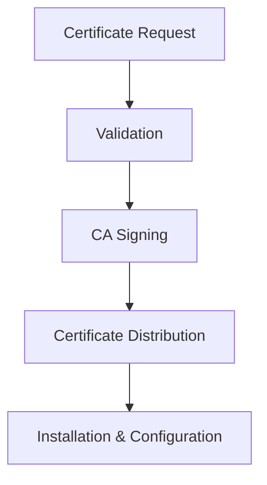

# PKI & Certificate Management Overview

## Trust Framework Architecture

The system relies on a comprehensive PKI infrastructure that issues and manages all certificates used across the platform.

### Certificate Authority Structure
- **Root CA**: Primary certificate authority
- **Intermediate CAs**: Specialized intermediate authorities for different certificate types
- **Certificate Types**:
  - TLS/SSL certificates for HTTPS communications
  - Client certificates for mTLS authentication
  - Signing certificates for document/payload signing
  - Encryption certificates for data protection

## Certificate Usage Map

### External Client Connectivity
- **Customer mTLS**: Client certificates for incoming customer connections
- **API Gateway TLS**: Server certificates for HTTPS endpoints
- **Webhook TLS**: Client certificates for outbound webhook calls

### Partner Connectivity  
- **Partner mTLS**: Mutual TLS certificates for partner integrations
- **B2B API Security**: Certificate-based authentication for partner APIs

### Internal Service Communication
- **Istio mTLS**: Service mesh internal communication
- **Database TLS**: MongoDB Atlas connection certificates
- **Inter-service Communication**: TLS for TypeScript services

## Certificate Lifecycle Management

### 1. Certificate Issuance

### 2. Certificate Monitoring
- **Expiration Tracking**: 90, 30, 7 days before expiry
- **Usage Monitoring**: Active certificate validation
- **Revocation Management**: CRL and OCSP handling

### 3. Certificate Renewal
- **Automated Renewal**: Where possible
- **Manual Renewal Process**: For critical certificates
- **Emergency Procedures**: Fast-track renewal for incidents

## Critical Certificate Inventory

| Certificate Type | Count | Renewal Frequency | Criticality | Monitoring |
|------------------|-------|-------------------|-------------|------------|
| Customer mTLS | ~50 | Annual | 🔴 Critical | Real-time |
| Partner mTLS | ~10 | Annual | 🔴 Critical | Real-time |
| API Gateway | 3 | 90 days | 🔴 Critical | Real-time |
| Istio Service Mesh | ~20 | 90 days | 🟡 High | Daily |
| MongoDB TLS | 1 | Annual | 🔴 Critical | Real-time |

## Troubleshooting Quick Reference

### Common Certificate Issues
1. **Expired Certificates**: Impact on service availability
2. **Certificate Mismatch**: Common Name/SAN validation failures  
3. **Chain Issues**: Incomplete certificate chain problems
4. **Revoked Certificates**: CRL/OCSP validation failures

### Emergency Contacts
- **PKI Team**: [Contact Information]
- **Certificate Management Tool**: [Tool Access]
- **Emergency Renewal Process**: [Process Documentation]

## Color Coding
- 🔴 Critical certificates (highlighted with `#3a5b5b` in diagrams)
- 🟡 Important certificates  
- 🟢 Standard certificates