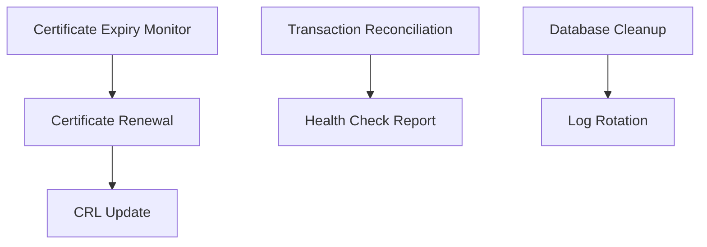

# Cron Jobs Documentation

## Cron Jobs Overview

The platform includes 7 scheduled cron jobs that handle batch processing, maintenance, and periodic tasks.

### Job Categories

#### 1. Certificate Management Jobs
- **Certificate Expiry Monitor**: Daily check for expiring certificates
- **Certificate Renewal Job**: Automated renewal process
- **CRL Update Job**: Certificate Revocation List updates

#### 2. Data Processing Jobs
- **Transaction Reconciliation**: Daily transaction matching
- **Database Cleanup**: Periodic data archival and cleanup

#### 3. System Maintenance Jobs
- **Health Check Report**: System health summary
- **Log Rotation**: Log file management and cleanup

## Cron Job Documentation Template

For each cron job, document:

### Job Information
- **Job Name**: 
- **Schedule**: Cron expression and timezone
- **Purpose**: What the job accomplishes
- **Duration**: Expected runtime
- **Dependencies**: Required services and resources

### Technical Implementation
- **Runtime**: Container or script execution
- **Code Location**: Repository and file path
- **Input Sources**: Databases, files, APIs accessed
- **Output**: Results, reports, or side effects
- **Error Handling**: How failures are managed

### Configuration
- **Environment Variables**: Job-specific settings
- **Resource Requirements**: CPU, memory, storage needs
- **Timeout Settings**: Maximum execution time
- **Retry Logic**: Failure retry configuration

### Monitoring
- **Success Metrics**: How to verify successful completion
- **Failure Detection**: How failures are identified
- **Alerting**: Notifications for job failures
- **Logging**: Where job logs are stored

### Security Considerations
- **Authentication**: How the job authenticates
- **Certificates**: Required certificates for operation
- **Data Access**: Permissions and access controls
- **Secrets Management**: Handling of sensitive data

## Critical Cron Jobs Schedule

| Job Name | Schedule | Criticality | Max Duration | Alert Threshold |
|----------|----------|-------------|--------------|-----------------|
| Certificate Expiry Monitor | `0 6 * * *` | 🔴 Critical | 10 min | 15 min |
| Certificate Renewal | `0 2 * * 0` | 🔴 Critical | 60 min | 90 min |
| Transaction Reconciliation | `0 3 * * *` | 🟡 High | 30 min | 45 min |
| Database Cleanup | `0 1 * * 0` | 🟢 Medium | 45 min | 60 min |
| CRL Update | `*/30 * * * *` | 🟡 High | 5 min | 8 min |
| Health Check Report | `0 */6 * * *` | 🟢 Medium | 2 min | 5 min |
| Log Rotation | `0 0 * * *` | 🟢 Medium | 15 min | 20 min |

## Job Dependencies

## Kubernetes CronJob Configuration

### Job Execution Environment
- **Namespace**: Dedicated namespace for cron jobs
- **Service Account**: Appropriate RBAC permissions
- **Resource Limits**: Defined CPU and memory limits
- **Restart Policy**: OnFailure or Never

### Job History and Cleanup
- **Success History**: Keep last 3 successful runs
- **Failed History**: Keep last 1 failed run for debugging
- **Cleanup Policy**: Automatic pod cleanup

### Monitoring Integration
- **Prometheus Metrics**: Job execution metrics
- **Grafana Dashboards**: Visual monitoring
- **Alert Manager**: Failure notifications

## Troubleshooting Guide

### Common Issues
1. **Job Timeout**: Execution exceeds configured timeout
2. **Resource Limits**: Memory or CPU constraints
3. **Certificate Expiry**: Authentication failures
4. **Database Connection**: Connectivity issues with MongoDB

### Debugging Steps
1. **Check Job Status**: `kubectl get cronjobs`
2. **Review Pod Logs**: `kubectl logs <pod-name>`
3. **Verify Configuration**: Environment variables and secrets
4. **Test Connectivity**: Database and external service access

### Emergency Procedures
- **Manual Job Execution**: How to trigger jobs manually
- **Job Suspension**: How to temporarily disable jobs
- **Recovery Procedures**: Steps after extended failures

## Job Monitoring Dashboard

Key metrics to track:
- **Execution Success Rate**: Jobs completing successfully
- **Execution Duration**: Time taken for each job
- **Queue Length**: Pending jobs waiting to execute
- **Error Rates**: Failure frequency and patterns

*Critical jobs highlighted with color `#3a5b5b` in monitoring dashboards*