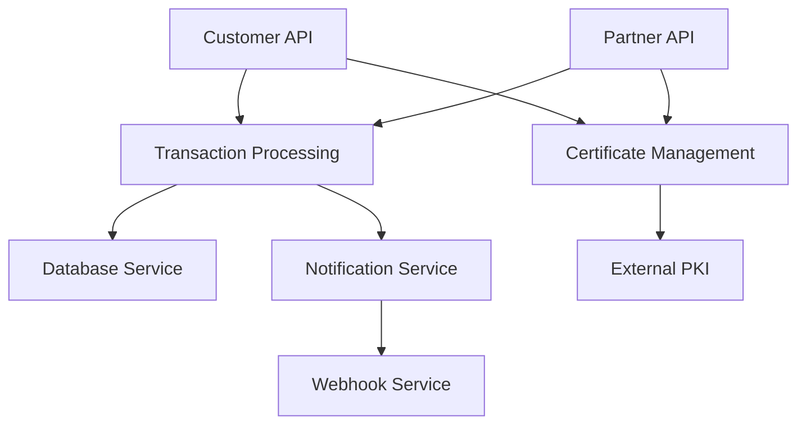

# Services Documentation

## TypeScript Services Overview

The platform consists of 11 TypeScript services that handle various business functions and integrations.

### Service Categories

#### 1. API Services
- **Customer API Service**: Handles incoming customer requests
- **Partner API Service**: Manages partner integrations
- **Webhook Service**: Manages outbound webhook deliveries

#### 2. Processing Services  
- **Transaction Processing Service**: Core business logic
- **Certificate Management Service**: PKI operations
- **Notification Service**: Customer communications

#### 3. Integration Services
- **Database Service**: MongoDB operations
- **External Integration Service**: Third-party API calls
- **Audit Service**: Compliance and logging

#### 4. Utility Services
- **Health Check Service**: System monitoring
- **Configuration Service**: Dynamic configuration management

## Service Documentation Template

For each service, document:

### Service Information
- **Service Name**: 
- **Purpose**: 
- **Repository**: 
- **Deployment**: Kubernetes namespace and deployment name
- **Dependencies**: Other services, databases, external systems

### Technical Details
- **Runtime**: Node.js version
- **Framework**: Express, Fastify, etc.
- **Database Connections**: MongoDB collections used
- **External APIs**: Third-party integrations
- **Certificates**: Required certificates for operation

### Configuration
- **Environment Variables**: Required and optional settings
- **Config Files**: Application configuration structure  
- **Secrets Management**: How sensitive data is handled
- **Feature Flags**: Runtime behavior toggles

### API Documentation
- **Endpoints**: REST API documentation
- **Authentication**: How the service authenticates requests
- **Authorization**: Access control mechanisms
- **Rate Limiting**: Throttling policies

### Monitoring & Health
- **Health Endpoints**: `/health`, `/ready`, `/live`
- **Metrics**: Prometheus metrics exposed
- **Logging**: Log format and levels
- **Alerting**: Critical alerts and thresholds

### Troubleshooting
- **Common Issues**: Frequent problems and solutions
- **Log Analysis**: How to read service logs
- **Performance Issues**: Debugging slow responses
- **Certificate Problems**: TLS/mTLS troubleshooting

## Service Dependency Map

## Critical Service Matrix

| Service | Criticality | Downtime Impact | Recovery Time | Dependencies |
|---------|-------------|-----------------|---------------|--------------|
| Customer API | 🔴 Critical | Revenue loss | < 5 min | Cert Mgmt, DB |
| Transaction Processing | 🔴 Critical | Service outage | < 10 min | Database |
| Certificate Management | 🔴 Critical | Security failure | < 15 min | PKI, Database |
| Webhook Service | 🟡 High | Customer notifications | < 30 min | Network, Certs |
| Partner API | 🟡 High | Partner integration | < 15 min | Cert Mgmt, DB |

## Deployment Information

### Container Images
- **Registry**: Azure Container Registry
- **Image Scanning**: Vulnerability scanning enabled
- **Base Images**: Node.js official images

### Kubernetes Configuration
- **Namespaces**: Service isolation strategy
- **Resource Limits**: CPU and memory constraints
- **Scaling**: HPA configuration
- **Service Mesh**: Istio sidecar configuration

### Rollout Strategy
- **Blue-Green Deployment**: Zero-downtime deployments
- **Canary Releases**: Gradual rollout process
- **Rollback Procedures**: Quick rollback in case of issues

*Critical services highlighted with color `#3a5b5b` in deployment diagrams*